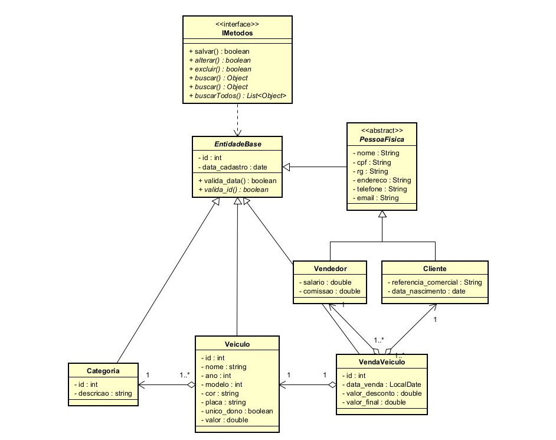

# Projeto de Programação 2 - Sistema de Venda de Veículos

## 📚 Disciplina
Programação 2 — Curso de Programação II  
Professor: Dr. Flávio Assis Vilela
2025/1

## 🧑‍💻 Aluno
**Nome:** Marcos Vinicius Vieira Matos

---

## 📌 Descrição do Projeto
Este projeto consiste no desenvolvimento de um sistema para gerenciamento de vendas de veículos, utilizando a linguagem **Java** e os princípios da arquitetura **MVCDAO**.

O sistema permite o cadastro e gerenciamento de:
- Veículos e suas categorias
- Clientes e vendedores
- Registros de vendas

A estrutura de classes foi desenvolvida com base na orientação a objetos e segue boas práticas de encapsulamento e reuso de código.

---

## 🏗️ Arquitetura Utilizada
O projeto adota o padrão **MVCDAO** (Model-View-Controller com Data Access Object), com separação clara entre:
- **Model:** Entidades do sistema e regras de negócio
- **DAO:** Camada de persistência (simulada ou com banco)
- **View:** Interface com o usuário (console ou GUI, dependendo da implementação)
- **Controller:** Coordena as interações entre View e Model
- **Util:** Camada com as classes abstratas
- **Interface:** Camada de Interface das classes
---

## 🧩 Diagrama de Classes

O diagrama abaixo representa a modelagem de classes utilizada no projeto:



### Principais Entidades
- **EntidadeBase:** Superclasse com atributos e métodos comuns como `id` e `data_cadastro`.
- **PessoaFisica (abstract):** Classe base para pessoas (Cliente e Vendedor).
- **Cliente / Vendedor:** Herdam de PessoaFisica e contêm atributos específicos.
- **Veiculo:** Representa os veículos disponíveis para venda.
- **Categoria:** Relaciona-se a um ou mais veículos.
- **VendaVeiculo:** Associa cliente, vendedor e veículo à uma venda.
- **IMetodos (interface):** Interface com operações básicas de CRUD.

---

## 🔧 Tecnologias Utilizadas
- **Java 11 ou superior**
- IDE recomendada: IntelliJ IDEA / Eclipse / NetBeans
- Organização em pacotes: `model`, `controller`, `view`, `dao`, `util`
- Padrão DAO implementado com listas simulando banco de dados (ou JDBC, se houver persistência real)

---

## ▶️ Como Executar
1. Clone ou baixe o repositório:
   ```bash
   git clone https://github.com/MarcosVVMK/prog2_projeto1.git

2. **Execute o seguinte comando no terminal:**

   ```bash
   docker compose up -d
   ```

   ou dependendo de sua versão do docker compose

   ```bash
   docker-compose up -d